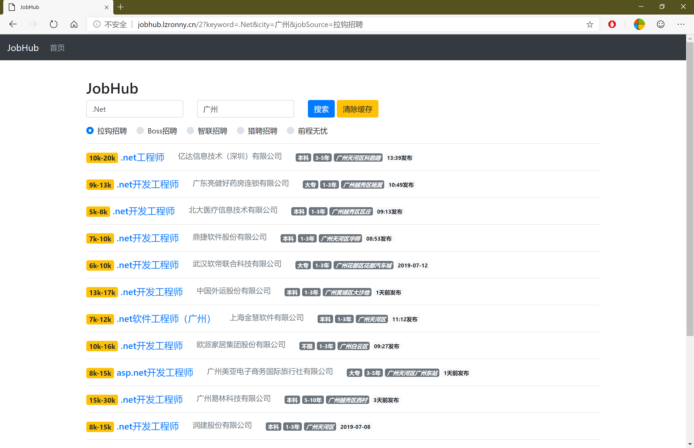

# JobHub   - Demo：[jobhub.lzronny.cn](http://jobhub.lzronny.cn)

  - [JobHub](http://github.com/nongzhsh/JobHub) 爬取各大网站（前程无忧、智联招聘、猎聘网…）即时展示有效的招聘信息。
  - 使用 [ABP_vNext](https://github.com/abpframework/abp) 做基础框架；
  - ``Memory Cache`` 作缓存；
  - [``RestSharp``](https://github.com/restsharp/RestSharp) 作 ``HttpClient``；
  - [``AngleSharp``](https://github.com/AngleSharp/AngleSharp) 作 ``HTML``  解析器。

## 仅供学习交流，请勿非法使用。

## 截图
